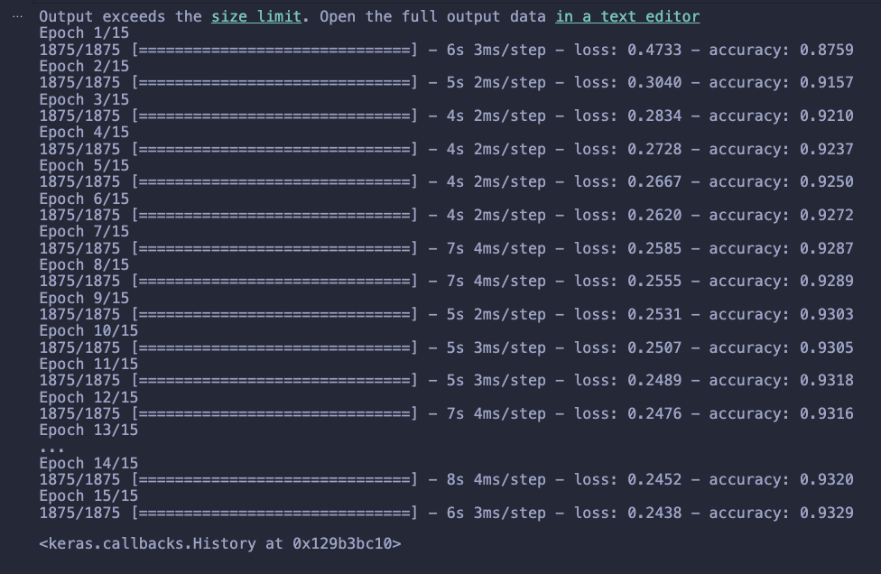
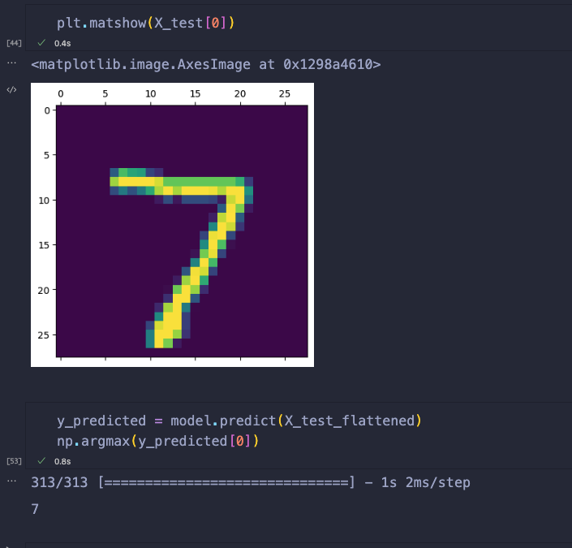

# Welcome to the Hello World of Deep Learning

Handwritten Digit Recognition using Machine Learning and Deep Learning

MNIST is a collection of handwritten digits from 0-9.
Image of size 28 X 28

# Training (epoch = 15)

# Prediction Sample

- Test Data : Handwritten Digit of 7
- Prediction : 7 (Success)
   

# Dataset

MNIST contains 70,000 images of handwritten digits

- 60,000 for training
- 10,000 for testing.
- The images are grayscale, 28x28 pixels

 

<b> Made with ❤️ by Akif Islam </b>

